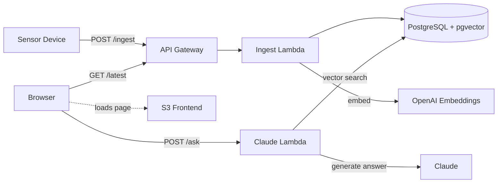

# Sense Platform

[](https://github.com/ryandau/sense-platform/actions/workflows/deploy.yml)


Sensor-agnostic IoT platform that ingests readings from any device, computes derived metrics via configurable breakpoints, and provides RAG-powered natural language queries over sensor data.

## Architecture



Fully defined in CDK (TypeScript). Private VPC networking, secrets in AWS Secrets Manager, SSL enforced.

## Features

- **Device ingestion** — accepts readings from any sensor via authenticated API, auto-registers devices
- **Breakpoint engine** — database-driven derived metrics (EPA AQI, Australian NEPM, CO2 status)
- **Embedding pipeline** — each reading vectorised and stored for similarity search
- **RAG queries** — natural language questions answered using pgvector retrieval and Claude
- **Auto-summary** — dashboard generates a status brief on load
- **Live dashboard** — real-time visualisation with severity indicators and data freshness tracking
- **Device firmware** — M5Stack AirQ reference implementation included

## Repo structure

```
sense-platform/
├── backend/                Ingest API, breakpoint engine, embedding generation
├── frontend/               Live dashboard with /ask interface
├── firmware/               M5Stack AirQ device firmware
├── infrastructure/         CDK stack, migration and Claude proxy Lambdas
├── scripts/                Bastion, faker simulator
└── .github/workflows/      CI/CD pipeline
```

## Endpoints

| Method | Path | Auth | Description |
|--------|------|------|-------------|
| POST | `/ingest` | API key | Submit a reading |
| POST | `/ask` | None | Ask a question about the data |
| GET | `/devices` | None | List registered devices |
| GET | `/devices/{id}/latest` | None | Latest reading |
| GET | `/devices/{id}/history` | None | Reading history |
| GET | `/types` | None | Supported device types |
| GET | `/health` | None | Health check |

## Getting started

See the [setup guide](docs/setup.md) for deployment, IAM configuration, and API key setup.

```bash
# Send a reading
curl -X POST https://<api-url>/ingest \
  -H "Content-Type: application/json" \
  -H "X-API-Key: <your-api-key>" \
  -d '{
    "device_id": "sensor-001",
    "type_slug": "air_quality",
    "data": {"pm2_5": 8.3, "co2_ppm": 420, "temperature": 24.5}
  }'
```

## Running tests

```bash
pip install -r backend/requirements.txt pytest ruff
pytest backend/tests/ -v
ruff check backend/
```

## License

MIT
