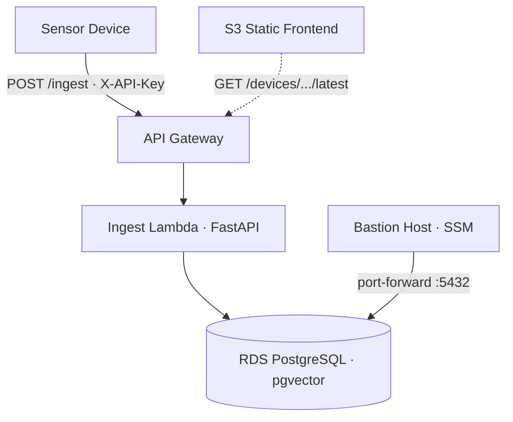

# Sense Platform

[](https://github.com/ryandau/sense-platform/actions/workflows/deploy.yml)

Sensor-agnostic IoT data ingestion platform. Accepts readings from any device type (air quality, soil, water, noise, environment), stores them in PostgreSQL with pgvector, and serves a live visualisation frontend.

The same endpoint accepts air quality monitors, soil sensors, water quality monitors, noise meters — anything that can make an HTTP request.

Stack: FastAPI, AWS Lambda, API Gateway, RDS PostgreSQL, pgvector, S3, AWS CDK, GitHub Actions

## Architecture



All infrastructure is defined in CDK (TypeScript). Secrets are managed via AWS Secrets Manager — no plaintext credentials in environment variables or CI. The database sits in isolated subnets with no public access. SSL is enforced on all database connections.

## Repo structure

```
sense-platform/
├── backend/                Python application code
│   ├── app/api/ingest.py     FastAPI ingest API (Lambda handler)
│   ├── requirements.txt      Python dependencies
│   └── tests/                Unit tests
├── frontend/               Static frontend
│   └── index.html            Single-page visualisation dashboard
├── scripts/                Helper scripts
│   ├── bastion.sh            Bastion start/stop/creds/status
│   └── faker.sh              Sensor data simulator
├── infrastructure/         AWS CDK stack
│   ├── lib/                  Stack definition
│   ├── lambda/               Migration Lambda source
│   └── bin/                  CDK app entry point
└── .github/workflows/      CI/CD pipeline
```

## Prerequisites

- AWS account with CDK bootstrapped
- GitHub repository secrets: `AWS_ACCESS_KEY_ID`, `AWS_SECRET_ACCESS_KEY`, `AWS_ACCOUNT_ID`
- Node.js 22+
- [AWS CLI](https://docs.aws.amazon.com/cli/latest/userguide/install-cliv2.html) and [Session Manager plugin](https://docs.aws.amazon.com/systems-manager/latest/userguide/session-manager-working-with-install-plugin.html) (for database access)
- Cloudflare DNS (optional, for custom domain)

## Deploy

Infrastructure deploys via GitHub Actions (manual trigger):

**Actions** > **Sense Platform CI/CD** > **Run workflow**

This provisions the full stack: VPC, RDS, Lambdas, API Gateway, S3 frontend bucket, bastion host, and Secrets Manager entries.

Backend code and frontend deploy automatically on every push to `main`.

## API usage

```bash
# Get your API key
aws secretsmanager get-secret-value \
  --secret-id sense-platform/api-key \
  --query SecretString --output text

# Send a reading
curl -X POST https://<api-url>/v1/ingest \
  -H "Content-Type: application/json" \
  -H "X-API-Key: <your-api-key>" \
  -d '{
    "device_id": "sensor-001",
    "type_slug": "air_quality",
    "latitude": -27.47,
    "longitude": 153.03,
    "data": {"pm2_5": 8.3, "co2_ppm": 420, "temperature_c": 24.5}
  }'
```

### Endpoints

| Method | Path | Auth | Description |
|--------|------|------|-------------|
| POST | `/ingest` | API key | Submit a sensor reading |
| GET | `/health` | None | Health check |
| GET | `/devices` | None | List all registered devices |
| GET | `/devices/{id}/latest` | None | Latest reading for a device |
| GET | `/devices/{id}/history` | None | Reading history (limit=100) |
| GET | `/types` | None | List supported device types |

## Supported device types

| Slug | Name | Key fields |
|------|------|------------|
| `air_quality` | Air Quality Monitor | pm2_5, pm10_0, co2_ppm, voc_index, temperature_c, humidity_pct |
| `soil` | Soil Sensor | moisture_pct, temperature_c, ph, nitrogen_ppm |
| `water_quality` | Water Quality Monitor | ph, turbidity_ntu, dissolved_o2, temperature_c |
| `noise` | Noise Monitor | db_avg, db_peak, db_min |
| `environment` | Environment Monitor | temperature_c, humidity_pct, pressure_hpa |

## Database access

The RDS instance is in an isolated subnet. A helper script handles bastion startup, port forwarding, and credentials:

```bash
./scripts/bastion.sh start    # Start bastion + port forward (localhost:5432)
./scripts/bastion.sh creds    # Print DB credentials for your client
./scripts/bastion.sh stop     # Stop the bastion when done
./scripts/bastion.sh status   # Check if bastion is running
```

Connect your database client (e.g. TablePlus) to `localhost:5432` using the credentials from `creds`.

## Frontend configuration

Edit the `CONFIG` block in `frontend/index.html`:

```javascript
const CONFIG = {
  SITE_NAME: '<your-domain>',
  LOCATION: '<your-location>',
  API_URL: 'https://<api-url>/v1/devices/<device-id>/latest',
  POLL_INTERVAL: 5000,
};
```

Changes to `frontend/` deploy automatically on push to `main`.

## Running tests

```bash
pip install -r backend/requirements.txt pytest ruff
pytest backend/tests/ -v
ruff check backend/
```

## License

MIT
