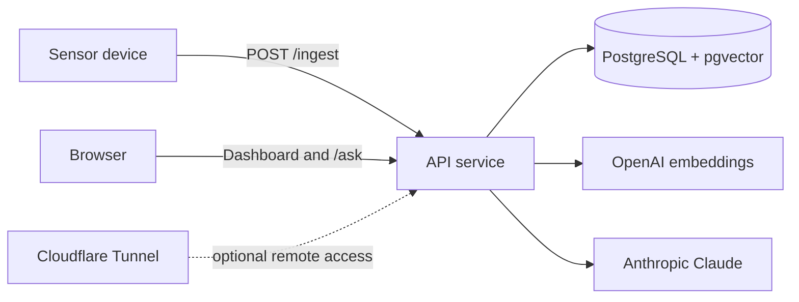

# Sense Platform

[](https://github.com/ryandau/sense-platform/actions/workflows/ci.yml)


[](LICENSE)

Sense Platform is a sensor-agnostic IoT platform that ingests device readings,
computes derived metrics from configurable breakpoints, and answers
natural-language questions about the data using retrieval-augmented generation.
It is self-hosted with Docker Compose.

## Contents

- [Features](#features)
- [Architecture](#architecture)
- [Requirements](#requirements)
- [Quick start](#quick-start)
- [Configuration](#configuration)
- [API](#api)
- [Documentation](#documentation)
- [Development](#development)
- [License](#license)

## Features

- Sensor-agnostic ingestion API with per-device authentication and automatic registration
- Configurable breakpoint engine for derived metrics (US EPA AQI, Australian NEPM, CO₂ status)
- Embedding pipeline that vectorises each reading for similarity search
- Retrieval-augmented `/ask` endpoint for natural-language queries over the data
- Live dashboard with severity indicators, data-freshness tracking, and generated status summaries
- Reference firmware for the M5Stack Air Quality Kit

## Architecture


```mermaid
flowchart LR
  sensor[Sensor device] -->|POST /ingest| api[API service]
  browser[Browser] -->|Dashboard and /ask| api
  api --> db[(PostgreSQL + pgvector)]
  api --> openai[OpenAI embeddings]
  api --> anthropic[Anthropic Claude]
  tunnel[Cloudflare Tunnel] -.->|optional remote access| api
```

A single FastAPI service exposes the ingestion API, the read endpoints, and the
`/ask` endpoint, and serves the dashboard from the same origin. Readings are
stored in PostgreSQL with the pgvector extension; each is embedded with OpenAI
and retrieved at query time to ground Claude's answers. Configuration is supplied
through environment variables. A Cloudflare Tunnel can be enabled for remote
access without inbound firewall changes.

## Requirements

- Docker and Docker Compose
- A continuously running host (single-board computer, server, or virtual machine)
- OpenAI and Anthropic API keys for the embedding and query layer

## Quick start

```bash
cp .env.example .env          # set SENSE_API_KEY, PGPASSWORD, OPENAI_API_KEY, ANTHROPIC_API_KEY
docker compose up -d db
./scripts/db-setup.sh fresh   # or: ./scripts/db-setup.sh restore <dump.sql.gz>
docker compose up -d api
```

The dashboard and API are served at `http://localhost:8000`. See the
[self-hosting guide](docs/self-hosting.md) for device setup and remote access.

## Configuration

Configuration is read from environment variables, typically a `.env` file (see
[`.env.example`](.env.example)).

| Variable | Required | Description |
|----------|----------|-------------|
| `SENSE_API_KEY` | Yes | Key that devices present to `/ingest` |
| `PGUSER`, `PGPASSWORD`, `PGDATABASE` | Yes | PostgreSQL credentials |
| `OPENAI_API_KEY` | Yes | Reading embeddings and vector search |
| `ANTHROPIC_API_KEY` | Yes | `/ask` answer generation |
| `TUNNEL_TOKEN` | No | Cloudflare Tunnel token for remote access |
| `SITE_NAME`, `API_PORT`, `DEFAULT_TIMEZONE` | No | Presentation and runtime defaults |

## API

| Method | Path | Auth | Description |
|--------|------|------|-------------|
| POST | `/ingest` | API key | Submit a reading |
| POST | `/ask` | None | Natural-language query over the data |
| GET | `/devices` | None | List registered devices |
| GET | `/devices/{id}/latest` | None | Most recent reading |
| GET | `/devices/{id}/history` | None | Reading history |
| GET | `/types` | None | Supported device types |
| GET | `/health` | None | Service health |

```bash
curl -X POST http://localhost:8000/ingest \
  -H "Content-Type: application/json" \
  -H "X-API-Key: $SENSE_API_KEY" \
  -d '{"device_id": "sensor-001", "type_slug": "air_quality",
       "data": {"pm2_5": 8.3, "co2_ppm": 420, "temperature": 24.5}}'
```

## Documentation

- [Self-hosting guide](docs/self-hosting.md) — installation, device setup, remote access, and operations
- [Device firmware](firmware/README.md) — building and configuring the reference device

## Development

```bash
pip install -r backend/requirements.txt pytest ruff
pytest backend/tests/ -v
ruff check backend/
```

## License

[MIT](LICENSE)
